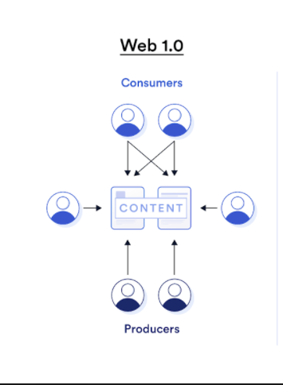
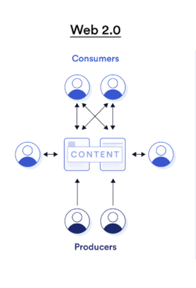
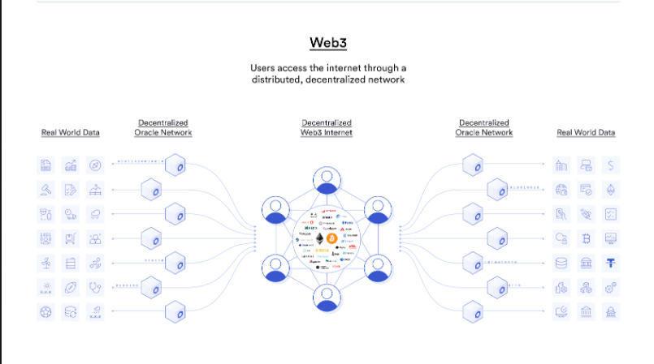
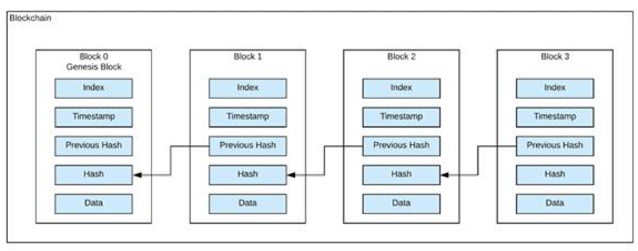
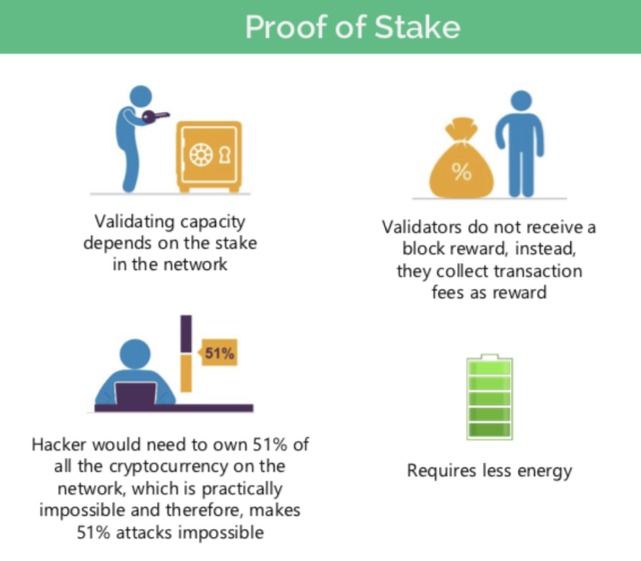

# Introductory Web 3
Over the past decade the field of crypto currency has exploded in popularity.  Backed by a tecnology called 'blockchains' crypto technologies have emerged as a major disruptor to many tech sectors.  While originally designed for creating currency, blockchains have evolved and are now being used to power applications in a 'decentralized' network. The term Web 3 refers to a new phase of the internet focused on peer-to-peer networks with no central authority all secyred by powerful cryptography.

# Some History Of The Web
The history of the web can be broken down into three phases.

## Web 1.0 
The first stage of the internet  spanning roughly the years 1990-2000.  Web 1.0 is considered 'read-only' with very little user generated content. Users mostly navigated to websites and consumed static pages and rarely did they interact with one another or create financial transactions.



## Web 2.0
The current version of the web roughly spanning the years 2000-present.   Increases if internet speed and figer optic infrastructure allowed for the evolution of streaming content and coud based infrastructre.  Encryption technologies also made financial interactions via the internet far more secure than they were in web 1. Web 2.0 is also the era of the social web.


Companies like Google, Amazon, and Facebook provide users services in exchange for their data. These companies then sell the user data for a profit and control is centralized in the hands of the companies that provide the service.  Web 2.0 made publishing content to the internet something everyone in the world could do with little to no training. However, the rise of data as a commodity has rasied many ethical concerns over privacy, censorship, and ultimately what role companies that provide a service should have with the data they get from their users.


## Web 3.0

The term Web 3 refers to a version of the interent that is fundamentally decentralized.  Rather than applications being controlled by massive companies like Google or Amazon, computational power is shared among numerous devices and blockchain technology insures that data is open, accessable, and decentralized, not hoarded by large companies.  
Web 3 technology relies on the use of blockchain technology and something called Smart Contracts to execute applications that run on open and available data sources.  Web 3 apps are not controlled by any central authority but rather are linked to the blockchain that they exist on in order to run.




## Web 3 Terminology
Web 3 has a lot of hype surrounding it and words like "Dapp", "Gas", and "Mining" are often thrown around.  In order to understand how web3 apps are structured we need to understand these concepts before we can begin to build applications for this new internet.
### Blocks
A block is an individual unit of storage that holds information in a database known as a blockchain.  A Block is very similar to the node of a Linked List. Blocks have a limited ammount of storage but always have a link to the block that came before them, unless they are the original block (which we will never have to worry about!). When we organize blocks together we create a Blockchain, which is the backbone of all Web 3 technology.

### Blockchains

One way to think of a blockchain is like ledger for a bank.  Imagine a record of every financial transaction that ever happened involving the US Dollar since it was invented.  That list would be <em>enormous</em> but with powerful enough computers it would be possible.  The Bitcoin blockchain is essentially that same concept, a continual record of every bitcoin transaction that has every been made.

Fun fact: as of 3/26/2022 the current [bitcoin ledger](https://ycharts.com/indicators/bitcoin_blockchain_size) is 397.53 GB of data.  This very large file is then distributed across an entire network of computers.

In 2008, Satoshi Nakamoto created the [Bitcoin Whtepaper](https://bitcoin.org/bitcoin.pdf) which outlined the basics of what became known as "Blockchain".  
Similar in structure to a Linked List, a Blockchain is a type of database where each item on the blockchain, or Block, is connected to the next.  



Each Block has a limited amount of storage.  Once filled, a new block is created and the new block points to the previous block which in turn points to its previous block forming a chain known as a Blockchain.
This ordering creates a chronological record of everything that happens on the blockchain and as a result, an open record of every transaction that the blockchain has ever made.  

When we refer to Web 3 applications we are most often refering to building applicaitons on the [Ethereum Blockchain](https://ethereum.org/en/)

### Nodes

A Node is a device on a blockchain network that allows the blockchain to remain open and decentralized.  All Nodes on a blockchain have a copy of the entire blockchain  that they belong to.  Every Bitcoin node has the entire Bitcoin ledger stored locally and the same is true of every Ethereum Node and the Ethereum ledger. This widely dispersed network ensures that information is secrure and readily available.  

### Wallet

A wallet is a string of numbers and letters like the following
```
18c177926650e558898003c320e136f22373b75
```
This string serves an adress that will appear on blocks as transactions occur on the blockchain.  This string is <strong>public</strong> and is one of the requirements for a transaction to occur .

### Private Key

To carry out a transaction you need two things: a wallet, which is basically an address, and a private key. The private key is another string of random numbers but unlike the wallet this <strong>must be kept secret</strong>.

A private key is an extremely large number that is used in cryptography, similar to a password. Private keys are used to create digital signatures that can easily be verified, without revealing the private key. Private keys are also used in cryptocurrency transactions in order to show ownership of a blockchain address.

### Minning

The term mining can mean different things on different blockchains but always refers to some form of computational work being done to the distributed ledger.  Minnig can be energy spent creating new coins to add to the ledger or for validating transactions on the blockchain between different parties.  The two common forms of mining are Proof Of Work (Bitcoin) and Proof Of Stake (Ethereum 2.0).

### Proof-OF-Work

Crypto mining is similar to the work done in actual physical mining.  Rather than pulling precious metals or gems from the ground, crypto miners trigger the release of new coins into  circulation.

For miners to be rewarded for their work, they must use their machine to solve incredibly complex mathemetical equiations.  Each transaction on the blockchain will create a specific signautre, called a Hash.  
Once a transaction has been created miners will compete with one another to zero in on the hash value it created.  The first miner to crack the code adds the block to the ledger and the new ledger is distributed across all the nodes in the network and the miner who did the work receives a reward.

